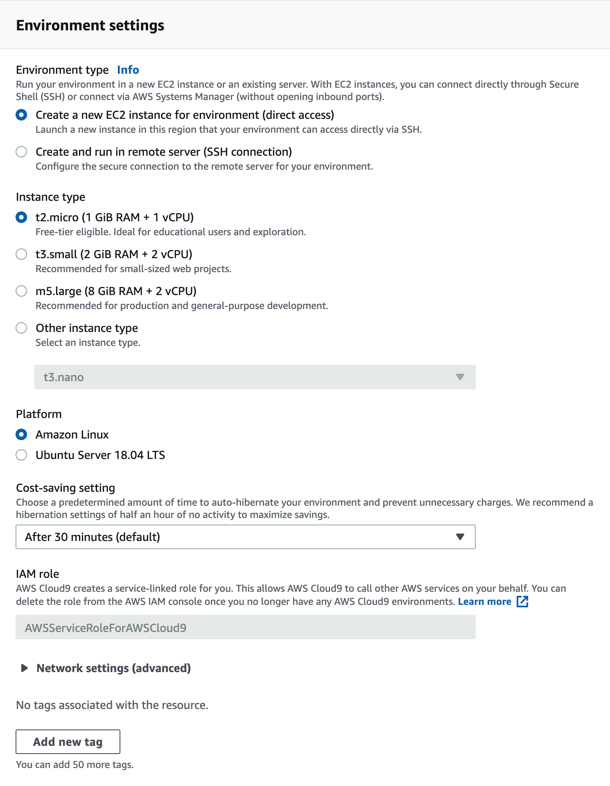

<br><br>
<br><br>
<br><br>

# Cloud9

## LAB Overview

#### This lab will whow you how to set up Cloud9 IDE and introduction to Amazon Aurora.

#### This lab will demonstrate:
 * Prepating Cloud9 development environment
 * Amazon Aurora using the AWS Management Console.

## Task 1. Prepare Cloud9 environment

In this task you will prepare Cloud9 devevlopment environment to work on your project.

1. In the AWS Management Console, on the **Services** menu, click **Cloud9**.
2. Click **Create environment**.
3. Enter a name for your environment, e.g. "student-x-environment".
4. Click **Next step**.
5. As "Environment type" select *Create a new EC2 instance for environment (direct access)*.
6. Select *t2.micro* as "Instance type".
7. Select *Amazon Linux* as **Platform**.
8. Set **Cost-saving setting** to *After 30 minutes (default)*.



IMPORTANT!!!
If you have already made your own VPC and want to use this environment inside this VPC:
* Unwind **Network settings (advanced)**
* Select your VPC
* SELECT **PUBLIC** SUBNET!!!

9. Click **Next step**.
10. Review your environment and click **Create environment**.


## Task 2: Create new DB Subnet Group
DB subnet group defines which subnets and IP ranges the DB instance can use in the VPC you selected. During Aurora instance creation is possible to let a wizard create a subnet group automatically. But for our lab, we want to have a full control of which subnets will be selected for Aurora cluster.

1. In the AWS Management Console, on the **Services** menu, click **RDS**.
2. In the left navigation pane, click **Subnet groups**.
3. Click **Create DB Subnet Group**.
4. On **Create DB subnet group**, step configure the following:

* **Name**: StudentX-DBSG
* **Description**: Your name
* **VPC**: Select VPC LAB-VPC
* Click **Add all the subnets related to this VPC**

It is the fastest way, select all and then remove unnecessary. If you followed VPC-LAB instructions correctly,
fours subnet should appear in **Subnets in this subnet group**. Now you need to remove the public subnets
by clicking **Remove** button. You should remove 10.X.0.0/24 and 10.X.1.0/24 and leave 10.X.10.0/24 and
10.X.11.0/24.

* Click **Remove** button for 10.X.0.0/24 (where X indicates your student number)
* Click **Remove** button for 10.X.1.0/24

5. Click **Create**.

## Task 3: Create a Aurora Cluster

In this task, you will create an Amazon Aurora cluster

1. In the left navigation pane, click **Databases**.
2. Click **Create database** button.
3. On **Create database**, select
   * Engine type: **Amazon Aurora**
   * Edition: **Amazon Aurora with MySQL compatibility**
   * Version: **Leave suggested option**
   * Database Location: **Regional**
   * Database features: **One writer and multiple readers**
   * Template: **Production**
   * DB cluster identifier: **StudentX-cluster**
   * Master password: **Type password and save it in notepad**
   * DB instance size: **Burstable classes**, select instance form list - **db.t2.small**
   * Multi-AZ deployment: **Create an Aurora Replica/Reader node in a different AZ (recommended for scaled availability)**
   * Virtual Private Cloud (VPC): **Select your VPC**
   * Expand **Additional connectivity configuration**
   * Subnet group: **Select group created in Task 1**
   * VPC security group: **Choose existing**
   * Existing VPC security groups: 
     * Select: **StudentX_DB**
     * Deselect: **default**
   * Expand **Addotional configuration**
   * Initial database name: **studentXdb**
   * Delection protection: **Unselect**
4. Click **Create database**.
5.  Wait until **Successfully created database studentX-mysql.** green information appear.
6.  Click **View credential details**.
7.  Copy **Master username**, **Master password** and **Endpoint** values to the notepad.

This is the only time you will be able to view this password. However you can modify your database to create a new password at any time.

## Task 4: Test your DB instance with cli (optional)

1. Connect to your laboratory Cloud9.

2. Install mysql tool:

 ```shell
 sudo yum install mysql -y
 ```

3. Connect to the database:

```bash
mysql -u admin -p -h enter_db_entpoint
```

4. List databases:

```my
show databases;
```

## Task 5: Test failover

It is possible to manually switch cluster node roles. Check the following steps. 

1.  Find your database cluster end expand it.
2.  Select you **Reader** node.
3.  Click **Actions** button and select **Failover**
4.  Click **Failover** to confirm.
5.  Click refresh button and verify changes. 

## END LAB

This is the end of this lab. Go over following steps to remove database cluster.

1. In the AWS Management Console, on the **Services** menu, click **RDS**.
2. In the left navigation pane, click **Databases**.
3. Find and expand your cluster.
4. Click on **Reader** node, select **Actions** button and choose **Delete**
5. Confirm by typing **delete me** and click **Delete**
6. Do the same with **Writer** node.
7. Skip final snapshot.

<br><br>

<p align="right">&copy; 2020 Welastic Sp. z o.o.<p>